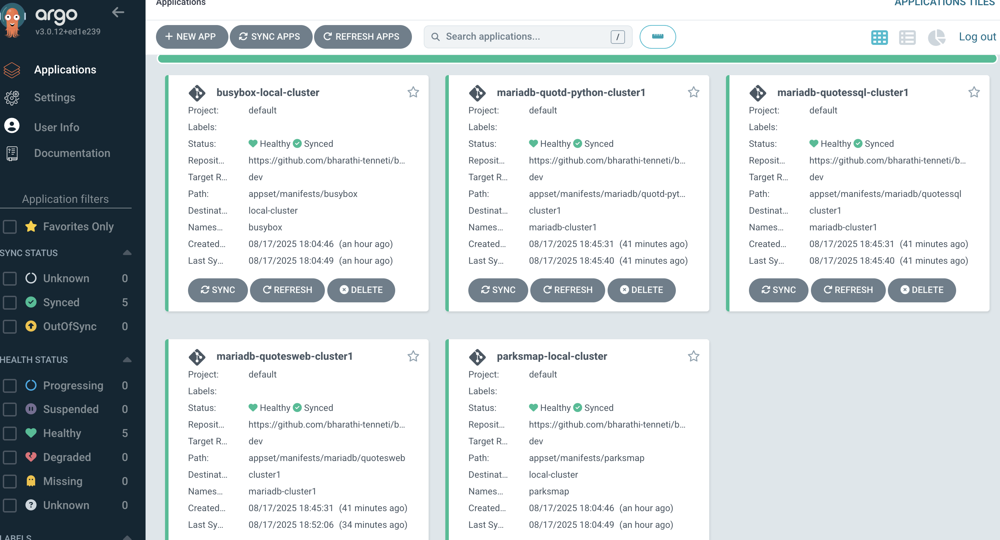
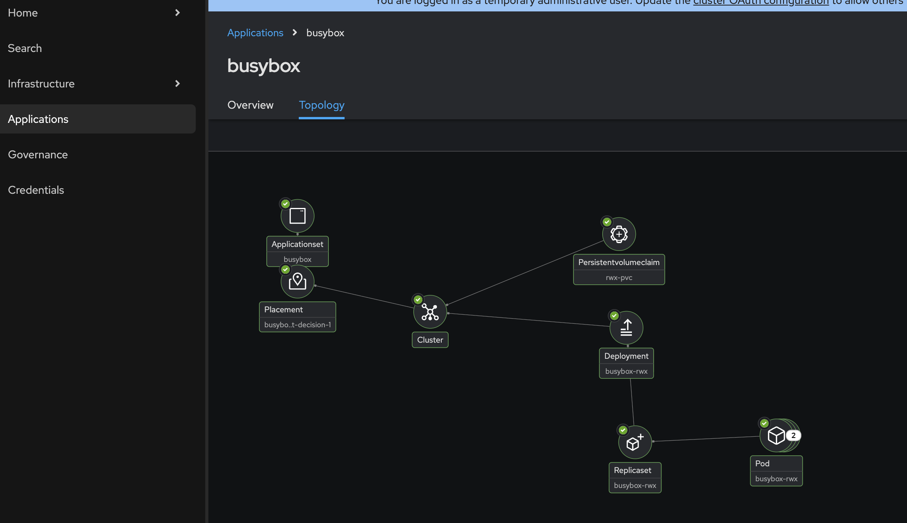

# basic-argoCD-acm-demo

This example show how to integrate RedHat Openshift Gitops with Advanced Cluster Management(ACM).

## Pre-Reqs:

1. Running Openshift cluster, and oc cli.
2. Install ODF, ACM, and Gitops Operators.

## Create Gitops-ACM integration, and necessary RBACs

```
oc create -f gitops-acm-integration.yaml
oc create -f gitops-rbac.yaml
```

## Create busy box application. This should create busy box deployment with 2 pods writing to a shared location. Make sure to pick the placement "gitops-clusters"
[!image](image/appset-placement.png)


Based on the placements that we created , busy box application should be created into all clusters falling under "global" clusterset.


