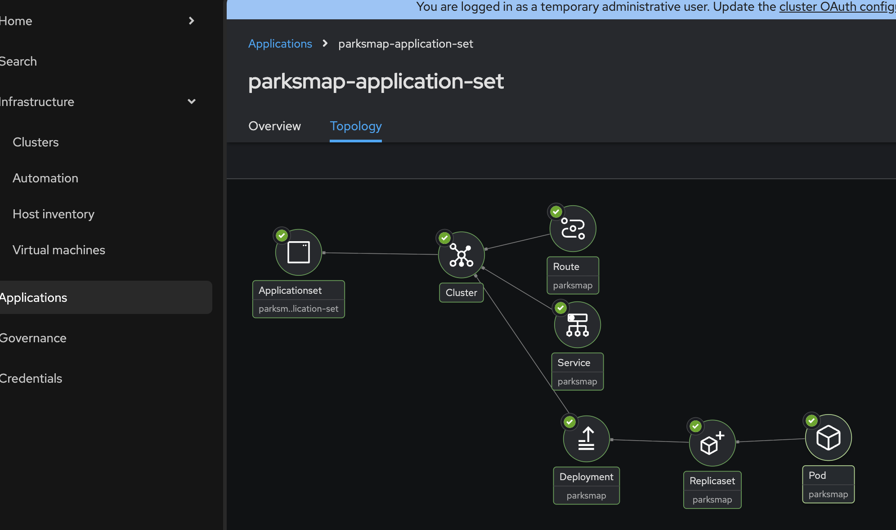
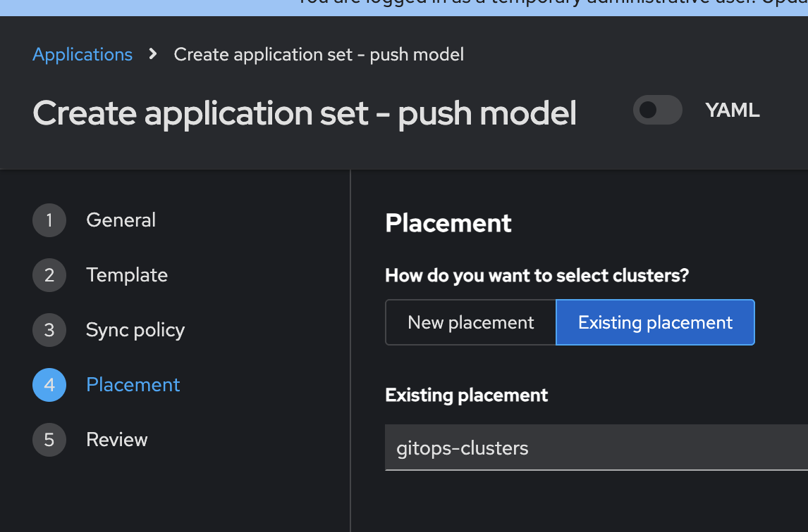

# basic-argoCD-acm-demo

This example show how to integrate RedHat Openshift Gitops with Advanced Cluster Management(ACM).

## Pre-Reqs:

1. Running Openshift cluster, and oc cli.
2. Install ODF, ACM, and Gitops Operators.

## Create Gitops-ACM integration, and necessary RBACs

```
oc create -f gitops-acm-integration.yaml
oc create -f gitops-rbac.yaml
```

### To create application using ApplicationSet from CLI. This should create parksmap application in a clusterset with name "managedset".
```
oc create -f appset/parksmap-appset.yaml
```


### Create busy box application using ACM GUI. 
This should create busy box deployment with 2 pods writing to a shared location. Make sure to pick the placement "gitops-clusters"
And from ACM GUI , provide below values:
git repo URL: "https://github.com/bharathi-tenneti/basic-argoCD-acm-demo.git"
path: apps




### Based on the placements that we created , busy box application should be created into all clusters falling under "global" clusterset.


